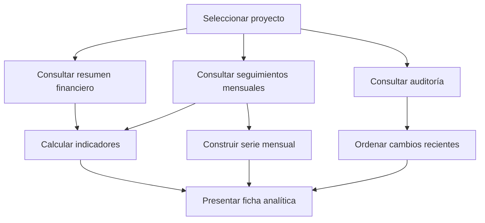

# Objetivo 3 — Actividad 19

## Implementar indicadores, gráficos e históricos por proyecto

**Producto:** ficha analítica funcional por proyecto  
**Formato:** enlace al repositorio y demostración web  
**Periodo previsto en el PA:** 2 al 5 de noviembre de 2026  
**Versión implementada:** 1.0.0

## 1. Objetivo

Complementar la ficha individual de cada proyecto con indicadores financieros, una representación cronológica de sus movimientos y un resumen de trazabilidad. La información presentada se calcula desde los registros del proyecto seleccionado y no mediante valores escritos manualmente en la interfaz.

## 2. Alcance implementado

La ficha del proyecto integra en una sola vista:

- Identificación, estado, servicio, municipio y datos contractuales.
- Resumen de facturación, pagos, costos, gastos y saldos.
- Indicadores específicos del proyecto.
- Gráfico de facturación, pagos y costos por mes.
- Historial de los cinco cambios más recientes.
- Accesos al seguimiento mensual, costos y gastos e historial completo.

## 3. Indicadores por proyecto

| Indicador | Cálculo | Utilidad |
|---|---|---|
| Avance financiero acumulado | Total facturado ÷ valor contractual vigente × 100 | Mide la proporción contractual facturada |
| Saldo contractual | Valor contractual vigente − total facturado | Identifica el valor pendiente por facturar |
| Pago pendiente | Total facturado − total pagado | Identifica la cartera pendiente |
| Cobro sobre lo facturado | Total pagado ÷ total facturado × 100 | Mide el recaudo de las facturas emitidas |
| Costos sobre el contrato | Costos y gastos ÷ valor contractual vigente × 100 | Relaciona el consumo de recursos con el contrato |
| Meses con movimiento | Cantidad de periodos únicos con valores financieros | Resume la continuidad del registro |
| Seguimientos por validar | Registros mensuales cuyo estado no es validado | Señala trabajo pendiente de revisión |

Cuando el denominador es cero, el indicador porcentual se presenta en cero y no se realiza una división inválida.

## 4. Evolución mensual

El gráfico individual agrupa hasta doce periodos del proyecto y compara tres series:

- Facturación del mes.
- Pagos registrados en el mes.
- Costos y gastos del mes.

Los periodos se ordenan cronológicamente. Los valores se representan en millones de pesos para conservar legibilidad. La facturación no se confunde con el pago: una representa el valor cobrado mediante factura y la otra el dinero efectivamente recibido.

Si Chart.js no está disponible, la aplicación genera una representación alternativa. Si el proyecto no tiene movimientos, presenta un estado vacío sin crear datos ficticios.

## 5. Histórico individual

La sección Historial reciente consulta los eventos asociados con el proyecto y presenta:

| Campo | Descripción |
|---|---|
| Fecha | Momento del cambio |
| Módulo | Proyectos, contratos, seguimiento, pagos, costos u otro componente relacionado |
| Acción | Creación, modificación o eliminación |
| Descripción | Resumen de los campos o del tipo de operación |

La ficha muestra los cinco eventos más recientes y ofrece acceso al historial completo con el proyecto preseleccionado.

## 6. Flujo de información

Las consultas se ejecutan de forma concurrente para reducir el tiempo de carga y conservar una única selección de proyecto durante toda la navegación.

## 7. Reglas aplicadas

- El avance financiero depende de la facturación acumulada.
- El pago pendiente nunca representa el saldo contractual: son conceptos distintos.
- Solo se cuentan como meses con movimiento los periodos válidos con valores financieros.
- Los registros borrador, pendiente o rechazado cuentan como seguimiento por validar.
- Los importes negativos o no numéricos no se incorporan a los indicadores.
- Los eventos se ordenan del más reciente al más antiguo.
- Los datos se limitan al proyecto seleccionado.

## 8. Componentes implementados

| Componente | Responsabilidad |
|---|---|
| domain/project-analytics.js | Cálculo puro de indicadores individuales |
| domain/dashboard.js | Agrupación cronológica de series mensuales |
| app.js | Consulta coordinada, representación del gráfico e historial |
| index.html | Estructura de la ficha analítica |
| styles.css | Adaptación visual y móvil |
| project-analytics.test.mjs | Pruebas de porcentajes, periodos y validación |

## 9. Seguridad y privacidad

En el modo conectado, las consultas utilizan la sesión autenticada y las políticas de acceso por fila de Supabase. La interfaz no usa llaves administrativas. La demostración pública conserva el mismo comportamiento con datos ficticios y aislados en el navegador.

## 10. Casos verificados

| Caso | Resultado esperado | Resultado |
|---|---|---|
| Proyecto con contrato y facturas | Calcula el avance y saldo contractual | Aprobado |
| Proyecto con pagos parciales | Calcula cobro y pago pendiente | Aprobado |
| Dos registros en el mismo mes | Cuenta un solo mes con movimiento | Aprobado |
| Seguimiento pendiente o borrador | Incrementa el indicador de validación | Aprobado |
| Valores inexistentes o negativos | Mantiene cálculos seguros | Aprobado |
| Proyecto sin movimientos | Muestra estado vacío | Aprobado |
| Proyecto con historial | Presenta los cinco cambios más recientes | Aprobado |
| Pantalla estrecha | Reorganiza gráfico e indicadores en una columna | Aprobado |

## 11. Resultado

La Actividad 19 queda implementada. Cada proyecto dispone de una ficha analítica con indicadores calculados, gráfico mensual e historial reciente, enlazada con los módulos operativos del aplicativo.
