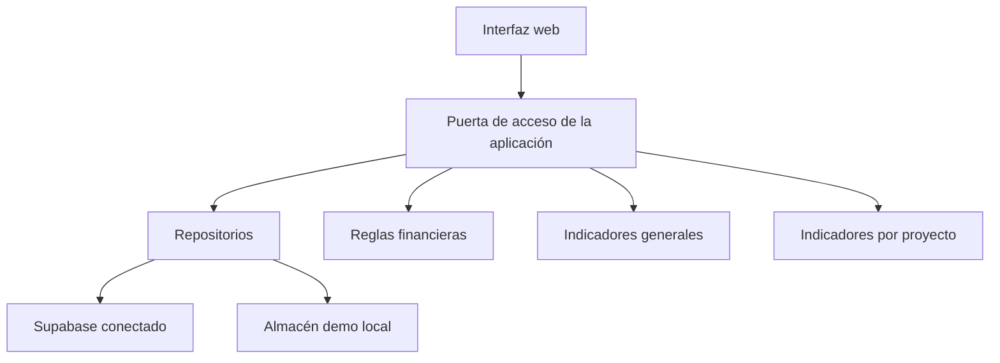
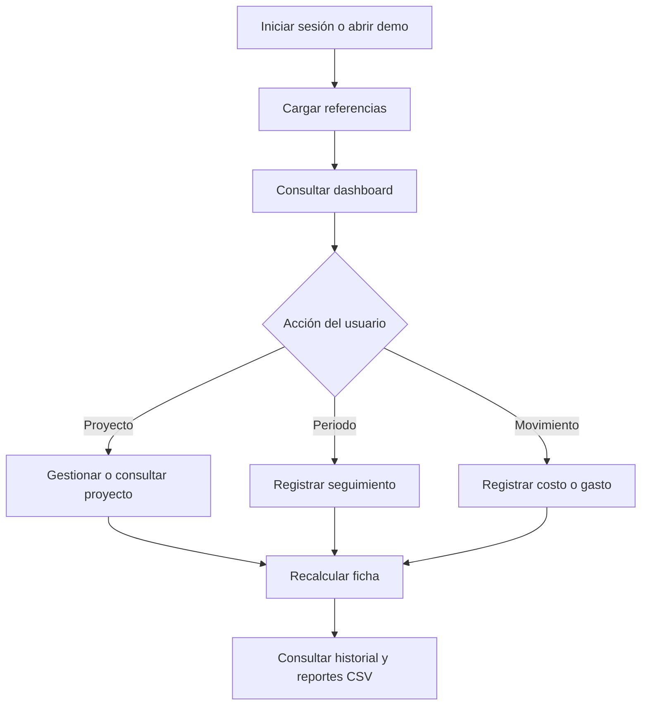

# Objetivo 3 — Actividad 20

## Integrar los componentes desarrollados en una versión funcional

**Producto:** versión integrada funcional  
**Formato:** enlace al repositorio y demostración web  
**Periodo previsto en el PA:** 4 al 6 de noviembre de 2026  
**Versión implementada:** 1.0.0

## 1. Objetivo

Integrar los componentes desarrollados para que funcionen como un solo aplicativo web coherente, con navegación estable, actualización controlada, recuperación de vistas y acceso consistente a la información financiera de los proyectos.

## 2. Versión integrada

La versión 1.0.0 reúne:

| Módulo | Funciones integradas |
|---|---|
| Inicio | Indicadores generales, estados, alertas, gráfico y exportación |
| Proyectos | Registro, edición, eliminación controlada, búsqueda y filtros |
| Detalle del proyecto | Resumen, datos contractuales, indicadores, gráfico e historial |
| Seguimiento mensual | Periodos, avance financiero, validación y bloqueo por cierre |
| Costos y gastos | Registro, filtros, totales y exportación |
| Historial | Consulta de auditoría, detalle antes/después y exportación |

El menú principal muestra únicamente estos módulos funcionales. Se retiraron accesos que todavía no tenían una operación completa para evitar rutas sin contenido.

## 3. Navegación integrada

La aplicación mantiene una ruta identificable para cada módulo:

| Ruta | Vista |
|---|---|
| #dashboard | Inicio |
| #projects | Proyectos |
| #detail/{id} | Ficha del proyecto seleccionado |
| #monthly | Seguimiento mensual |
| #costs | Costos y gastos |
| #history | Historial |

Al recargar el navegador, se recupera la vista solicitada. Si la ruta no existe o el proyecto indicado no está disponible, el sistema vuelve al dashboard de forma segura.

## 4. Actualización de información

El encabezado incorpora:

- Identificación del modo de datos: demostración local o datos conectados.
- Hora de la última actualización.
- Botón Actualizar para recargar proyectos, periodos y seguimiento.
- Conservación de la vista activa después de actualizar.
- Prevención de activaciones repetidas mientras la carga está en curso.

## 5. Integración de datos

La misma interfaz trabaja con dos implementaciones de datos. El modo se selecciona desde la configuración y las reglas de cálculo no cambian entre la demo y la conexión segura.

## 6. Flujo funcional consolidado

## 7. Reglas de integración

- El proyecto es el contexto central de contratos y movimientos.
- El periodo abierto determina si se pueden modificar registros mensuales.
- La facturación calcula el avance; los pagos disminuyen la cartera pendiente.
- Los costos y gastos se presentan separados de facturación y pagos.
- Las operaciones generan trazabilidad.
- Los filtros seleccionados se conservan dentro del módulo correspondiente.
- La actualización vuelve a consultar las fuentes y reconstruye indicadores.
- Las rutas no reconocidas no exponen pantallas incompletas.

## 8. Experiencia de usuario

- Estructura visual uniforme en todos los módulos.
- Navegación lateral limitada a funciones disponibles.
- Búsqueda global de proyectos desde cualquier vista.
- Estados vacíos cuando no existen registros.
- Mensajes de carga, confirmación y error.
- Formularios en cuadros de diálogo.
- Diseño adaptable a escritorio, tableta y teléfono.
- Colores y etiquetas además del valor visual para comunicar estados.

## 9. Seguridad

- Autenticación gestionada por Supabase en el entorno conectado.
- Políticas RLS para restringir registros por usuario autorizado.
- Llave pública separada de credenciales administrativas.
- Sin contraseñas ni llaves sensibles en el repositorio.
- Demo pública con información ficticia y persistencia local.
- Validaciones de integridad tanto en interfaz como en base de datos.
- Trazabilidad de creaciones, modificaciones y eliminaciones.

## 10. Verificación integrada

La suite automática contiene 59 casos y cubre:

- Reglas financieras.
- Modelos y transformación de datos.
- CRUD de proyectos.
- Costos y gastos.
- Periodos y seguimiento mensual.
- Historial y auditoría.
- Búsqueda y filtros.
- Indicadores generales.
- Indicadores por proyecto.
- Navegación, actualización, rutas y versión integrada.

## 11. Criterios de aceptación

| Criterio | Evidencia | Resultado |
|---|---|---|
| Los módulos se abren desde un solo aplicativo | Navegación principal | Aprobado |
| No existen opciones principales sin función | Menú reducido a cinco vistas | Aprobado |
| La información puede actualizarse | Botón Actualizar y hora visible | Aprobado |
| La vista se recupera al recargar | Rutas por hash | Aprobado |
| El detalle conserva el contexto del proyecto | Ruta con identificador y filtros preseleccionados | Aprobado |
| Los indicadores usan los datos disponibles | Módulos de dominio probados | Aprobado |
| La demo no expone datos empresariales | Almacén ficticio separado | Aprobado |
| La interfaz responde en tamaños reducidos | Reglas CSS adaptables | Aprobado |
| La suite no presenta fallos | Ejecución automatizada | Aprobado |

## 12. Resultado

La Actividad 20 queda implementada con la versión funcional integrada 1.0.0. El aplicativo permite recorrer el proceso principal de gestión, seguimiento, consulta financiera y trazabilidad sin acceder a módulos incompletos. La demostración pública y el código privado comparten el comportamiento funcional, manteniendo separados los datos y la configuración.
