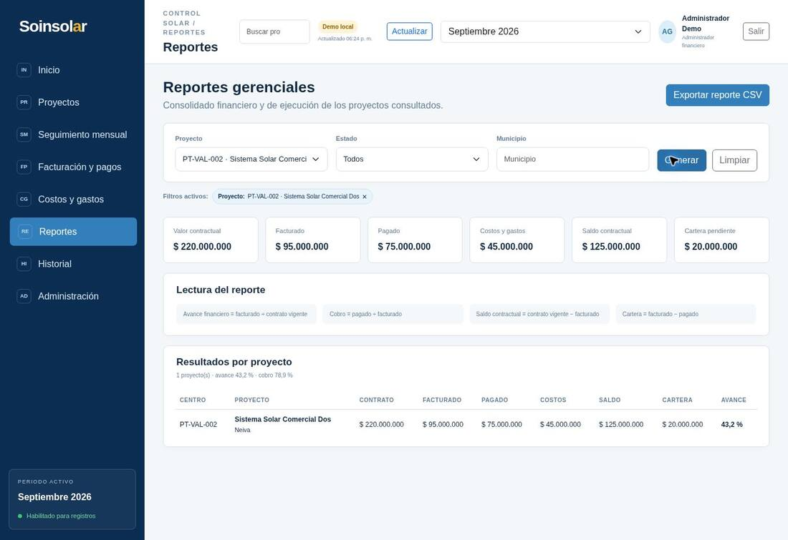

# Caso de prueba de uso 002 — ciclo financiero con facturas y pagos parciales

**Sistema:** SOINSOLAR Control  
**Versión evaluada:** 1.1.0  
**Fecha de ejecución:** 22 de septiembre de 2026  
**Entorno:** demostración pública con persistencia local  
**Tipo de evidencia:** prueba funcional guiada y ejecutada con datos ficticios  
**Centro de costo:** PT-VAL-002

## 1. Propósito

Comprobar que el aplicativo permite administrar un proyecto desde su creación hasta el reporte gerencial cuando existen varias facturas, pagos parciales y movimientos de costos y gastos. El caso también verifica que la aplicación impida registrar una factura duplicada y un pago superior al saldo disponible.

Todos los nombres, referencias, cifras y soportes son ficticios. Esta prueba no contiene información financiera real de SOINSOLAR S.A.S. BIC.

## 2. Alcance

La prueba recorre y relaciona los siguientes módulos:

1. Proyectos.
2. Gestión contractual.
3. Facturación y pagos.
4. Costos y gastos.
5. Seguimiento mensual.
6. Reportes gerenciales.
7. Historial y trazabilidad.

La ejecución valida cálculos y controles de la demostración pública. No reemplaza la aprobación formal que deben realizar Andrés Gutiérrez y la gerencia durante el Objetivo 4.

## 3. Condiciones iniciales

Antes de iniciar:

1. Abra la [demostración pública](https://andresflorez2000.github.io/soinsolar-control-demo/?demo=1).
2. Pulse **Entrar al prototipo**.
3. Confirme que el encabezado muestre **Demo local**.
4. Seleccione el periodo **Septiembre 2026**.
5. Verifique que el periodo indique **Habilitado para registros**.
6. No utilice clientes, contratos, facturas, pagos, proveedores ni soportes reales.

Los cambios de la demostración se guardan únicamente en el navegador utilizado. Un evaluador que abra el enlace desde otro navegador deberá reproducir los pasos descritos.

## 4. Datos completos del escenario

### 4.1 Proyecto

| Campo | Dato de prueba |
|---|---|
| Centro de costo | PT-VAL-002 |
| Nombre | Sistema Solar Comercial Dos |
| Cliente | Cliente Anónimo B |
| Municipio | Neiva |
| Tipo de servicio | Diseño e instalación |
| Potencia | 80 kWp |
| Estado | Activo |
| Fecha de inicio | 01/09/2026 |
| Fecha de finalización | 31/01/2027 |
| Observación | Caso de prueba integral 002 con datos ficticios. |

### 4.2 Contrato

| Campo | Dato de prueba |
|---|---:|
| Número | CTR-VAL-002 |
| Estado | Vigente |
| Valor inicial | $200.000.000 |
| Adiciones | $30.000.000 |
| Deducciones | $10.000.000 |
| Valor vigente esperado | $220.000.000 |
| Fecha inicial | 01/09/2026 |
| Fecha final | 31/01/2027 |

### 4.3 Facturas

| Factura | Fecha | Estado | Valor | Referencia ficticia |
|---|---|---|---:|---|
| FAC-VAL-002A | 05/09/2026 | Emitida | $60.000.000 | pruebas/FAC-VAL-002A.pdf |
| FAC-VAL-002B | 25/09/2026 | Emitida | $35.000.000 | pruebas/FAC-VAL-002B.pdf |

### 4.4 Pagos

| Pago | Factura | Fecha | Estado | Valor | Referencia ficticia |
|---|---|---|---|---:|---|
| PAG-VAL-002A-1 | FAC-VAL-002A | 12/09/2026 | Confirmado | $40.000.000 | pruebas/PAG-VAL-002A-1.pdf |
| PAG-VAL-002A-2 | FAC-VAL-002A | 22/09/2026 | Confirmado | $20.000.000 | pruebas/PAG-VAL-002A-2.pdf |
| PAG-VAL-002B-1 | FAC-VAL-002B | 28/09/2026 | Confirmado | $15.000.000 | pruebas/PAG-VAL-002B-1.pdf |

### 4.5 Costos y gastos

| Tipo | Categoría | Fecha | Descripción | Proveedor ficticio | Referencia | Valor |
|---|---|---|---|---|---|---:|
| Costo | Materiales | 08/09/2026 | Materiales eléctricos del caso de prueba. | Proveedor ficticio Alfa | DOC-VAL-002-01 | $28.000.000 |
| Costo | Mano de obra | 14/09/2026 | Mano de obra técnica del caso de prueba. | Proveedor ficticio Beta | DOC-VAL-002-02 | $10.000.000 |
| Gasto | Transporte | 16/09/2026 | Transporte y logística del caso de prueba. | Proveedor ficticio Gamma | DOC-VAL-002-03 | $7.000.000 |

### 4.6 Seguimiento mensual

| Campo | Dato de prueba |
|---|---|
| Periodo | Septiembre 2026 |
| Estado inicial | Pendiente de validación |
| Valor reconocido | $95.000.000 |
| Observación | Corte mensual del caso 002; cifras conciliadas contra facturas y pagos ficticios. |

## 5. Paso a paso ejecutado

### Paso 1. Ingresar a la demostración

1. Abra el enlace de la demostración.
2. Pulse **Entrar al prototipo**.
3. Revise el indicador de la parte superior.
4. Confirme que aparece **Demo local** y que el periodo activo es **Septiembre 2026**.

**Resultado esperado:** se muestran los ocho módulos y el periodo permite registrar movimientos.  
**Resultado observado:** aprobado.

### Paso 2. Crear el proyecto

1. Abra **Proyectos**.
2. Pulse **Nuevo proyecto**.
3. Ingrese cada dato de la sección 4.1.
4. Pulse **Guardar proyecto**.
5. Busque `PT-VAL-002` en el listado.
6. Pulse **Abrir** en la fila correspondiente.

**Resultado esperado:** el sistema crea una sola fila, conserva los datos descriptivos y abre la ficha integral.  
**Resultado observado:** el mensaje fue **Proyecto creado correctamente** y la ficha mostró cliente, municipio, servicio, potencia y fechas correctos.

### Paso 3. Registrar el contrato

1. En la ficha del proyecto, pulse **Gestionar contrato**.
2. Registre `CTR-VAL-002`.
3. Seleccione **Vigente**.
4. Ingrese valor inicial, adiciones y deducciones.
5. Revise el valor calculado.
6. Pulse **Guardar contrato**.

**Fórmula aplicada:**

`Valor vigente = valor inicial + adiciones − deducciones`

`$200.000.000 + $30.000.000 − $10.000.000 = $220.000.000`

**Resultado observado:** la ficha mostró **Valor contractual vigente: $220.000.000**.

### Paso 4. Registrar la factura A

1. Abra **Facturación y pagos**.
2. Pulse **Nueva factura**.
3. Seleccione `PT-VAL-002` y **Septiembre 2026**.
4. Registre fecha 05/09/2026, número `FAC-VAL-002A`, estado **Emitida** y valor $60.000.000.
5. Escriba la referencia ficticia del soporte.
6. Pulse **Guardar factura**.

**Resultado observado:** factura creada por $60.000.000, con saldo inicial de $60.000.000.

### Paso 5. Registrar la factura B

1. Pulse nuevamente **Nueva factura**.
2. Seleccione el mismo proyecto y periodo.
3. Registre fecha 25/09/2026, número `FAC-VAL-002B`, estado **Emitida** y valor $35.000.000.
4. Guarde.

**Cálculo acumulado:**

`Total facturado = $60.000.000 + $35.000.000 = $95.000.000`

**Resultado observado:** el módulo mostró **Total facturado: $95.000.000**, cartera de $95.000.000 y dos facturas con saldo.

### Paso 6. Registrar el primer pago parcial de la factura A

1. En la fila `FAC-VAL-002A`, pulse **Registrar pago**.
2. Registre `PAG-VAL-002A-1`, fecha 12/09/2026, estado **Confirmado** y valor $40.000.000.
3. Guarde.

**Cálculo:**

`Saldo de FAC-VAL-002A = $60.000.000 − $40.000.000 = $20.000.000`

**Resultado observado:** la factura A quedó con saldo de $20.000.000.

### Paso 7. Completar el pago de la factura A

1. Vuelva a pulsar **Registrar pago** en `FAC-VAL-002A`.
2. Registre `PAG-VAL-002A-2`, fecha 22/09/2026, estado **Confirmado** y valor $20.000.000.
3. Guarde.

**Cálculo:**

`Saldo de FAC-VAL-002A = $60.000.000 − ($40.000.000 + $20.000.000) = $0`

**Resultado observado:** el saldo quedó en $0 y el botón para agregar otro pago quedó deshabilitado.

### Paso 8. Registrar el pago parcial de la factura B

1. En la fila `FAC-VAL-002B`, pulse **Registrar pago**.
2. Registre `PAG-VAL-002B-1`, fecha 28/09/2026, estado **Confirmado** y valor $15.000.000.
3. Guarde.

**Cálculos:**

- Saldo de factura B: `$35.000.000 − $15.000.000 = $20.000.000`.
- Total pagado: `$40.000.000 + $20.000.000 + $15.000.000 = $75.000.000`.
- Cartera: `$95.000.000 − $75.000.000 = $20.000.000`.

**Resultado observado:** el módulo mostró total pagado de $75.000.000, cartera de $20.000.000 y una factura con saldo.

### Paso 9. Registrar costos y gastos

1. Abra **Costos y gastos**.
2. Pulse **Nuevo movimiento** y registre el costo de materiales por $28.000.000.
3. Repita el proceso para mano de obra por $10.000.000.
4. Repita el proceso seleccionando **Gasto** para transporte por $7.000.000.
5. Filtre por `PT-VAL-002` y **Septiembre 2026**.

**Cálculos:**

- Costos: `$28.000.000 + $10.000.000 = $38.000.000`.
- Gastos: `$7.000.000`.
- Total costos y gastos: `$38.000.000 + $7.000.000 = $45.000.000`.

**Resultado observado:** tres movimientos, costos por $38.000.000, gastos por $7.000.000 y total consultado de $45.000.000.

### Paso 10. Registrar el seguimiento mensual

1. Abra **Seguimiento mensual**.
2. Pulse **Registrar seguimiento**.
3. Seleccione `PT-VAL-002` y **Septiembre 2026**.
4. Seleccione **Pendiente de validación**.
5. Registre valor reconocido de $95.000.000 y la observación definida en la sección 4.6.
6. Guarde.

El porcentaje no se digita manualmente. La aplicación lo obtiene de la facturación:

`Avance financiero mensual = $95.000.000 ÷ $220.000.000 × 100 = 43,1818 %`

**Resultado observado:** el sistema mostró $95.000.000 facturados, **43,2 %** de avance mensual, **43,2 %** acumulado, $45.000.000 en costos y gastos y estado pendiente.

El estado pendiente es correcto para esta evidencia: la aprobación final debe efectuarla el usuario empresarial autorizado; el documento no suplanta esa decisión.

### Paso 11. Revisar el reporte gerencial

1. Abra **Reportes**.
2. Seleccione `PT-VAL-002`.
3. Pulse **Generar**.
4. Compare todos los indicadores con la matriz de resultados de la sección 6.

**Resultado observado:** los seis totales y los porcentajes coincidieron con los cálculos independientes.

### Paso 12. Revisar el historial

1. Abra **Historial**.
2. Seleccione `PT-VAL-002`.
3. Pulse **Aplicar filtros**.
4. Revise los eventos de proyecto, contrato, facturación, pagos, costos/gastos y seguimiento.

**Resultado observado:** se encontraron **11 eventos**:

- 1 creación de proyecto;
- 1 creación de contrato;
- 2 creaciones de factura;
- 3 creaciones de pago;
- 3 creaciones de costo o gasto;
- 1 creación de seguimiento mensual.

Los intentos rechazados no generaron movimientos financieros ni eventos de creación.

## 6. Matriz de resultados financieros

| Indicador | Fórmula | Esperado | Observado | Estado |
|---|---|---:|---:|---|
| Contrato vigente | 200.000.000 + 30.000.000 − 10.000.000 | $220.000.000 | $220.000.000 | Aprobado |
| Total facturado | 60.000.000 + 35.000.000 | $95.000.000 | $95.000.000 | Aprobado |
| Total pagado | 40.000.000 + 20.000.000 + 15.000.000 | $75.000.000 | $75.000.000 | Aprobado |
| Costos y gastos | 28.000.000 + 10.000.000 + 7.000.000 | $45.000.000 | $45.000.000 | Aprobado |
| Saldo contractual | 220.000.000 − 95.000.000 | $125.000.000 | $125.000.000 | Aprobado |
| Cartera pendiente | 95.000.000 − 75.000.000 | $20.000.000 | $20.000.000 | Aprobado |
| Avance financiero | 95.000.000 ÷ 220.000.000 × 100 | 43,18 % | 43,2 % | Aprobado |
| Recaudo | 75.000.000 ÷ 95.000.000 × 100 | 78,95 % | 78,9 % | Aprobado |
| Tasa de costos | 45.000.000 ÷ 220.000.000 × 100 | 20,45 % | 20,45 % calculado | Aprobado |
| Diferencia facturación-costos | 95.000.000 − 45.000.000 | $50.000.000 | $50.000.000 calculado | Aprobado |

La diferencia facturación-costos es un indicador operativo; no debe interpretarse como utilidad contable porque el sistema no incluye impuestos, nómina, inventario, retenciones ni todos los costos empresariales.

## 7. Pruebas negativas ejecutadas

### 7.1 Intento de sobrepago

Después de pagar $15.000.000 sobre `FAC-VAL-002B`, quedaban $20.000.000. Se intentó registrar `PAG-VAL-002B-ERROR` por $21.000.000.

**Resultado esperado:** rechazo y conservación del saldo.  
**Mensaje observado:** **Los pagos activos no pueden superar el valor de la factura.**  
**Estado:** aprobado. El pago no fue creado y la cartera permaneció en $20.000.000.

### 7.2 Intento de factura duplicada

Se intentó crear otra factura con el número `FAC-VAL-002A`.

**Resultado esperado:** rechazo por número duplicado.  
**Mensaje observado:** **Ya existe una factura con ese número.**  
**Estado:** aprobado. El total facturado permaneció en $95.000.000.

## 8. Lectura empresarial del caso

Al finalizar el escenario, la gerencia puede interpretar lo siguiente:

- El contrato vigente es de $220.000.000.
- Se han facturado $95.000.000, equivalentes al 43,2 % financiero del contrato.
- Se han recaudado $75.000.000.
- Quedan $20.000.000 por cobrar de las facturas ya emitidas.
- Quedan $125.000.000 del contrato sin facturar.
- Los costos y gastos registrados suman $45.000.000.
- La factura A está completamente pagada.
- La factura B conserva una cartera de $20.000.000.

Es importante no confundir los dos saldos:

- **Saldo contractual:** parte del contrato que todavía no se ha facturado.
- **Cartera pendiente:** parte de lo ya facturado que el cliente todavía no ha pagado.

## 9. Resultado general

**Resultado técnico del caso:** aprobado con 11 eventos trazables y 2 controles negativos aprobados.

La aplicación mantuvo coherencia entre contrato, facturación, pagos, cartera, costos, seguimiento e informe gerencial. No se observaron diferencias entre los cálculos independientes y los valores presentados por el reporte. La validación empresarial del seguimiento continúa siendo una acción consciente del rol autorizado y debe registrarse como evidencia durante la sesión formal del Objetivo 4.

## 10. Registro del evaluador empresarial

| Dato | Registro |
|---|---|
| Nombre | |
| Cargo o rol | |
| Fecha | |
| Navegador y versión | |
| Resultado | Aprobado / Aprobado con observaciones / No aprobado |
| Observaciones | |
| Evidencia de aprobación | |

